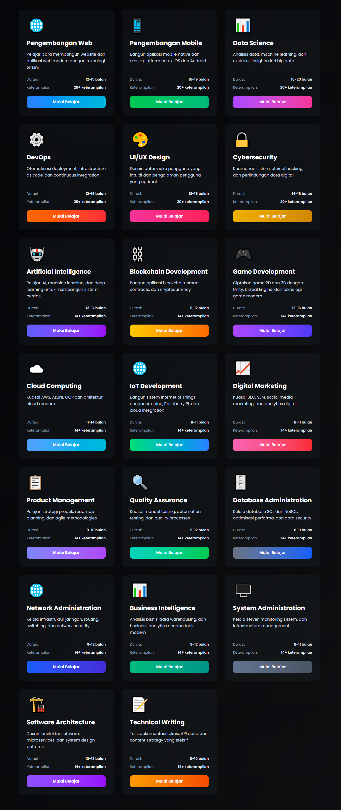
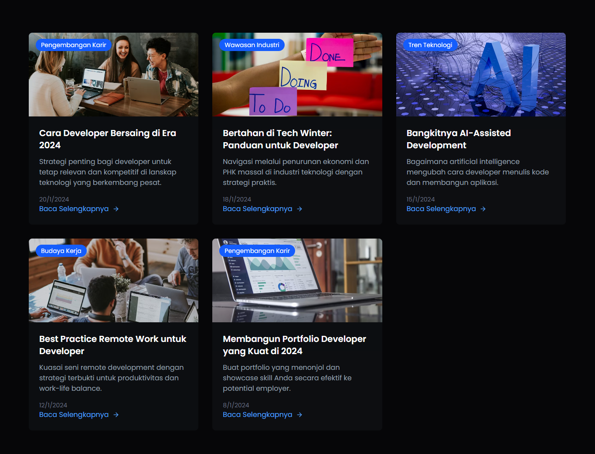
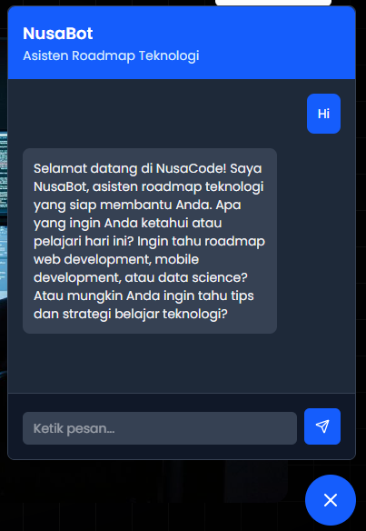

# NusaCode

NusaCode adalah platform edukasi teknologi berbasis web yang dirancang untuk memudahkan pengguna mempelajari berbagai roadmap teknologi secara interaktif dan praktis. Platform ini mendukung dua bahasa, Indonesia dan Inggris, sehingga dapat menjangkau pengguna yang lebih luas.

---

## Fitur Utama

- **Roadmap Interaktif**  
  NusaCode menyediakan lebih dari 20 roadmap teknologi, termasuk Web Development, Mobile Development, dan Data Science. Setiap roadmap disusun secara sistematis untuk memandu pengguna langkah demi langkah.

  

- **Halaman Artikel Edukasi**  
  Berisi artikel-artikel teknologi terbaru dan tips belajar yang membantu pengguna memperdalam wawasan.

  

- **Chatbot Interaktif (NusaBot)**  
  Fitur chatbot yang siap membantu menjawab pertanyaan pengguna secara real-time, membuat proses belajar menjadi lebih mudah dan personal.

  

---

## Teknologi yang Digunakan

- React Typescript
- Tailwind CSS untuk desain responsif dan modern
- API chatbot custom untuk interaksi real-time

---

NusaCode bertujuan menjadi solusi edukasi teknologi yang praktis, mudah diakses, dan adaptif sesuai kebutuhan pengguna masa kini.

